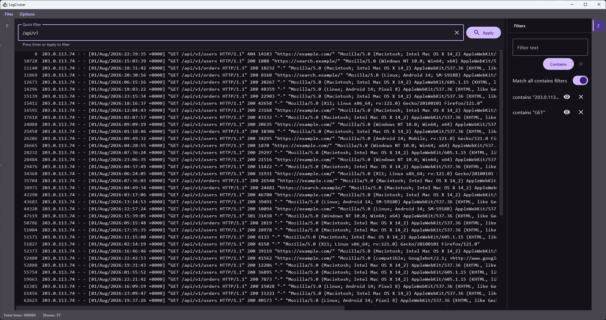

# LogCruiser

LogCruiser is a desktop log viewer for opening, searching, and filtering text log files. It's fast and modern. Written
with Kotlin Multiplatform so it works on all operating systems.



## Features

- Open local text and log files.
- Search visible lines with a quick substring filter.
- Add reusable `contains` and `not contains` filters.
- Match multiple `contains` filters using either any or all semantics.
- Track indexing and filtering progress, with cancellation while indexing.
- Keep source line numbers visible while scrolling horizontally through long lines.
- Switch between light and dark themes.

## TODO

- JSON log support
- More filter types
- Line mapping rules (transform lines (trim, align, color))
- Live log following
- Plain log mapping to JSON and column creation by patterns

## Installing

Go to [Releases](https://github.com/Eivyses/LogCruiser/releases/latest) and download the latest version for your OS.

## Getting started

LogCruiser is currently a desktop-only Kotlin application. A JDK 21 installation is required to build it.

Run the application from the repository root:

```shell
./gradlew :desktopApp:run
```

For Compose hot reload during development:

```shell
./gradlew :desktopApp:hotRun --auto
```

Run the shared JVM tests with:

```shell
./gradlew :shared:jvmTest
```

## Project structure

- [`shared`](./shared) contains the file indexing, line reading, filtering, and shared tests.
- [`desktopApp`](./desktopApp) contains the Compose Desktop application and UI.

## Contributing

Bug reports, feature ideas, and pull requests are welcome. Please open an issue before larger changes so the direction
can be discussed first.
